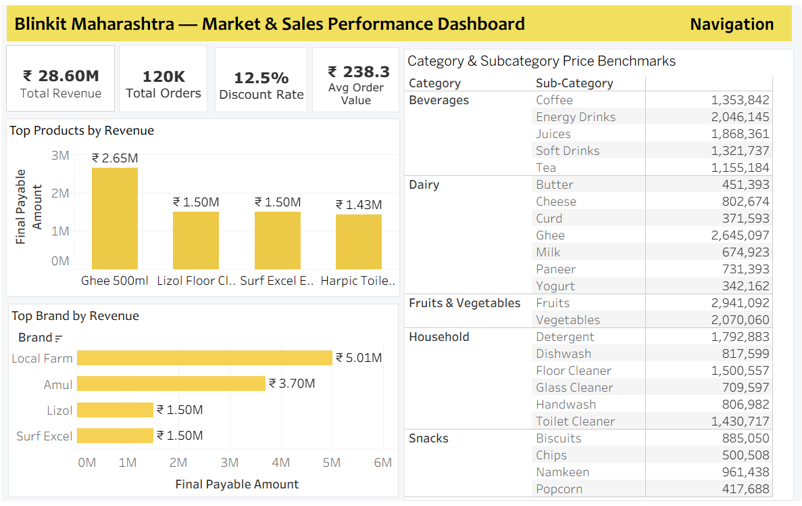
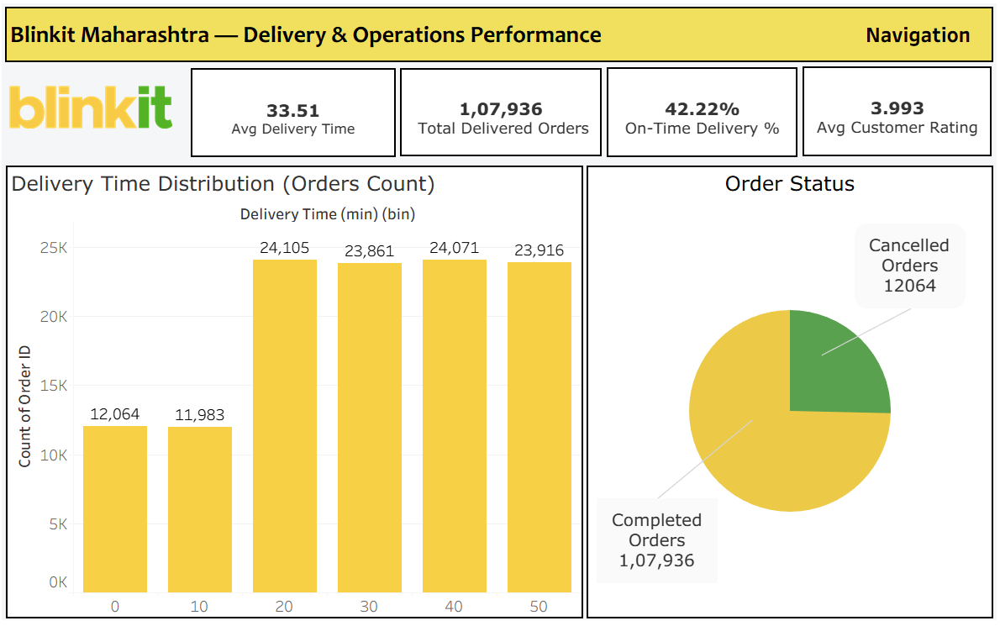

# Blinkit Maharashtra – Business Performance & Customer Analytics

## 📌 Project Overview
This project presents an end-to-end **Business Performance Analytics Dashboard** developed using **Tableau**.  
The analysis focuses on **Blinkit’s operations in Maharashtra**, covering key business areas such as **sales performance, delivery operations, customer experience, store operations, and customer acquisition & retention**.

The objective of this project is to demonstrate how a **data analyst** can transform raw transactional data into **clear dashboards, structured insights, and professional documentation** that support business decision-making.

---

## 🎯 Business Questions Addressed
The analysis aims to answer the following key business questions:

- Which products, categories, and brands drive the most revenue?
- How efficient are delivery operations at scale?
- How does delivery performance relate to customer experience?
- Are store operations consistent across locations?
- Is customer growth driven by acquisition, retention, or both?

---
## Dataset Overview
The analysis is based on a **transaction-level dataset** representing Blinkit’s grocery delivery operations in Maharashtra.

- **Region:** Maharashtra  
- **Total Orders:** ~120,000  
- **Total Customers:** ~29,500  
- **Data Granularity:** Order-level transactional data  

### Key Business Domains Covered:
- Sales & Revenue
- Delivery & Operations
- Customer Experience
- Store Operations
- Customer Acquisition & Retention

**Key metrics include:**
- Revenue, orders, discounts, average order value (AOV)  
- Delivery time, on-time delivery percentage, order status  
- Customer ratings and satisfaction trends  
- Store-level performance  
- New vs returning customers and platform usage  

> ⚠️ **Disclaimer:** Blinkit is a real company; however, this dataset is used strictly for **educational and portfolio purposes** and does not represent actual business performance.

---

## 📊 Dashboards
The Tableau solution consists of **five business-focused dashboards**, each covering a specific domain:

### 1️⃣ Market & Sales Performance
- Revenue, total orders, average order value (AOV)
- Discount analysis
- Category, sub-category, brand, and product contribution

### 2️⃣ Delivery & Operations Performance
- Average delivery time
- On-time delivery percentage (≤ 30 minutes)
- Order completion vs cancellation
- Delivery time distribution

### 3️⃣ Store Operations Overview
- Store-level performance
- City and area-based analysis
- Order status and customer rating comparison

### 4️⃣ Customer Experience & Delivery Performance
- Average customer rating
- Rating distribution
- Rating vs delivery time
- Rating by order status

### 5️⃣ Customer Acquisition & Retention
- Total customers
- New vs returning customers
- Platform-wise customer acquisition (Android / iOS / Web)

---

### 🔹 Dashboard Preview

#### Market and sales Performance

#### Delivery and Operation Performance

---

📄**Full Dashboard (All Pages – PDF):**  
🔹[View Complete Dashboard PDF](05_Dashboards/Dashboard.pdf)

This PDF contains **all dashboard pages across Market & Sales, Delivery & Operations, Retail Store, and Customer analysis**.

---

#### 🌐 Tableau Public – Interactive Dashboards

The complete set of interactive dashboards and the Tableau Story are published on Tableau Public.

👉 **View the project on Tableau Public:**  
🔗 [gauravshinde17](https://public.tableau.com/app/profile/gauravshinde17/viz/BlinkitMaharashtraBusinessPerformanceAnalysis/MarketSalesPerformance)

---
## Key Insights

### Sales & Revenue
- Revenue is driven by a limited number of high-performing products and brands
- Essential categories such as beverages, dairy, and household items dominate sales
- Average order value and discounting provide insights into pricing strategy

---

### Delivery & Operations
- Most deliveries occur between 20–50 minutes
- On-time delivery (≤30 minutes) remains a challenge at scale
- Order cancellations highlight potential fulfillment and inventory issues

---

### Customer Experience
- Customer ratings remain stable around 4.0
- Ratings do not decline sharply with higher delivery times
- Customer satisfaction appears influenced by factors beyond speed alone

---

### Store Operations
- Store-level performance remains consistent across cities and areas
- No extreme underperforming stores observed

---

### Customer Acquisition & Retention
- Balanced split between new and returning customers
- Even customer distribution across Android, iOS, and Web platforms

---

## Key Takeaways
- Business performance depends on a balance between **speed, reliability, and customer satisfaction**
- Delivery efficiency is a key improvement area
- Stable customer ratings indicate strong service perception
- Integrated dashboards help connect operational and customer insights

---

## 📂 Project Documentation
This repository includes **professional documentation**, similar to what is used in real analytics teams:

- [**Business Analytics Case Study**](03_Documentation/Blinkit_Case_Study.pdf)
   
  Explains project background, problem statement, dataset, analytical approach, dashboards built, and tools used.

- [**Calculated Field & Analytical Logic**](03_Documentation/Blinkit_Calculated_Field_Logic.pdf)
   
  Documents all key KPIs using Tableau calculated fields with transparent logic.

- [**Business Insights Report**](04_Insights/Blinkit_Insights_Report.pdf)
  
  Contains dashboard-wise observations written in simple, clear language.

---

## 🛠 Tools & Technologies Used
- **Tableau Public** – Dashboarding and storytelling  
- **Excel / CSV** – Data source  
- **Business Intelligence concepts** – KPIs, distributions, performance analysis  

---

